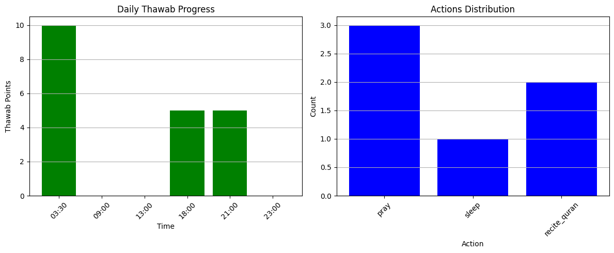

# FaithAgent-A-Reinforcement-Learning-Simulation

> A context-aware, ethically aligned reinforcement learning agent designed to simulate spiritually motivated decision-making based on Islamic values and seerah (Prophetic tradition). This work as preliminary research aimed at modeling faith-aware autonomous agents — not merely for fatwa automation, but for simulating Islamic decision-making using agent-based frameworks.

---

## Run it on Google Colab
<a href="https://colab.research.google.com/drive/1CazCpZqiw5F3hOjabsA_HIqfhHxK0OEi?usp=sharing"></a>  
1. Click above link to run this project with a single click.  
2. Click Run All button to run
3. Run it multimple times to check how the simulation is performing.

---

## Table of Contents

- [Overview](#overview)
- [Core Concepts](#core-concepts)
- [Features](#features)
- [Sample Scenarios](#sample-scenarios-simulated)
- [Seerah Database Structure](#seerah-database-structure)
- [Visualization](#visualization-example)
- [Sample Output](#sample-output)
- [Academic Motivation](#academic-motivation)
- [Future Work](#future-work)
- [Contributions & Contact](#-contributions--contact)
- [License](#license)

---

## Overview

**FaithAgent** is an experimental reinforcement learning environment that models the behavior of a spiritually conscious agent in a simulated daily routine. Unlike typical AI agents that optimize for utility or task performance, FaithAgent optimizes for **Islamic ethical reward (thawab)**, validated by both general Islamic rules and **seerah-based** historical references.

This project is a step toward building culturally sensitive, value-aligned agents using symbolic reward systems and agent simulation frameworks.

---

## Core Concepts

- **Contextual Decision-Making:** The agent selects actions based on time-sensitive contexts such as `"fajr_on_time"` or `"sickness"`.
- **Islamic Reward System:** Actions are scored with spiritually grounded reward values (e.g. praying during war yields more reward than skipping prayer).
- **Seerah-Based Validation:** Decisions are validated against recorded incidents from the life of the Prophet Muhammad ﷺ.
- **Stochastic Context Generation:** Realistic variations (like war or illness) are introduced using probability to simulate uncertainty.
- **Visualization:** Built-in charts show thawab progression and action distributions across the day.

---

## Features

- Rule-based Islamic action validation (e.g. pray at fajr time = valid)
- Seerah database for historically grounded validation
- Enhanced priority system for actions in life contexts (war, sickness, rain, etc.)
- Time-aware and probabilistically varying environments
- Graphical summary of rewards and behavior
- Final performance report with seerah compliance

---

## Sample Scenarios Simulated

- *“Should I pray during a battle?”*
- *“What is the best time to recite Surah Mulk if I work through the night?”*
- *“If I’m sick, what action has the highest spiritual reward?”*
- *“How should I structure my day to maximize Islamic values?”*

---

## Seerah Database Structure
```
{
  "pray_during_war": {
    "action": "pray",
    "context": "during_war",
    "reward": 20,
    "source": "Battle of Khandaq: Prophet ﷺ prayed under attack"
  },
  "recite_mulk_night": {
    "action": "recite_quran",
    "context": "night",
    "reward": 5,
    "source": "Hadith: Surah Mulk protects from grave punishment"
  }
}
```

## Visualization Example

- **Thawab Trend:** Hourly reward progression  
- **Action Distribution:** Frequency of actions like `pray`, `recite_quran`, `work`

> 

---

## Sample Output

```text
03:30 | Action: pray            | Context: fajr_on_time   | Reward: +10 | Valid: True (Basic Islamic Rule)
09:00 | Action: pray            | Context: work           | Reward: +0 | Valid: False (Action not validated)
13:00 | Action: sleep           | Context: dhuhr_delayed  | Reward: +0 | Valid: False (Action not validated)
18:00 | Action: recite_quran    | Context: night          | Reward: +5 | Valid: True (Basic Islamic Rule)
21:00 | Action: recite_quran    | Context: night          | Reward: +5 | Valid: True (Basic Islamic Rule)
23:00 | Action: pray            | Context: sleep          | Reward: +0 | Valid: False (Action not validated)
```

## Academic Motivation

This simulation is part of a broader research direction in value-aligned AI, particularly for applications where faith, ethics, and cultural norms play a critical role in autonomous agent behavior.

## Inspired by:

iStar-RL: Goal-oriented and uncertainty-aware RL environments  
AI Ethics & Autonomy: Agents operating under moral/spiritual constraints  
Symbolic Reasoning: Embedding Islamic rulings and seerah as symbolic rules


## Future Work

 Integrate NLP for contextual awareness (e.g. user asks questions)  
 Expand seerah stories using a knowledge graph  
 Connect to fatwa engines or Islamic rule ontologies  
 Adopt iStar-RL or BDI agent modeling frameworks  
 Introduce internal states (e.g. tiredness, sincerity)  

## 🤝 Contributions & Contact

If you are passionate about ethical reinforcement learning, Islamic knowledge modeling, or AI for social good — feel free to reach out!

📧 Email: heytelot@gmail.com  
🌐 Website / LinkedIn: <a href="https://www.linkedin.com/in/mosfaiulalam/">
  
</a>  
🌍 Timezone: GMT+6 (Dhaka, Bangladesh)  

## License

MIT License.
Open-source for academic and non-commercial use. Contact for commercial licensing or publication rights.

"Rather than merely returning fatwas, I aim to simulate agents capable of reasoning through complex Islamic ethical decisions in varying contexts."
